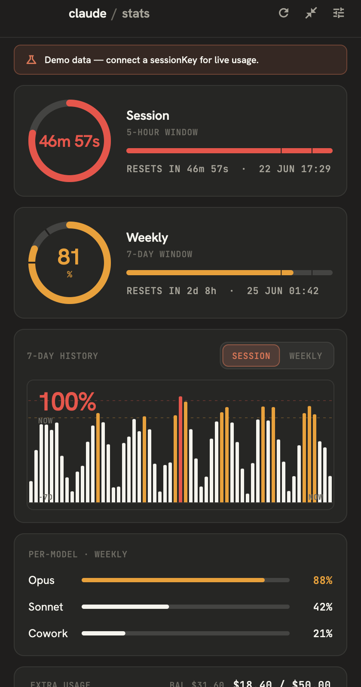

```text
      _                 _             _        _
  ___| | __ _ _   _  __| | ___    ___| |_ __ _| |_ ___
 / __| |/ _` | | | |/ _` |/ _ \  / __| __/ _` | __/ __|
| (__| | (_| | |_| | (_| |  __/  \__ \ || (_| | |_\__ \
 \___|_|\__,_|\__,_|\__,_|\___|  |___/\__\__,_|\__|___/
```

# claude·stats

> A tiny, Claude-themed desktop widget that tells you how much Claude you have left to Claude.

[](https://github.com/digitaljohn/claude-stats)
[](https://flutter.dev)
[](#testing)
[](#testing)
[](LICENSE)

A minimal macOS desktop widget that watches your **Claude.ai usage limits** in
real time — session, weekly, per-model — so you find out you're rate-limited
*before* you're mid-sentence on the thing that was definitely going to work this
time.

<p align="center">
  
</p>

> _Yes, it's a Claude usage monitor. Yes, it was built with Claude (in Claude
> Code). We've achieved full recursion. Please clap._

---

## Where this came from

Full credit where it's due: this is a Flutter cover version of
[**SlavomirDurej/claude-usage-widget**](https://github.com/SlavomirDurej/claude-usage-widget) —
the excellent Electron original that pioneered the "log into claude.ai, read the
usage endpoint, draw some rings" idea. We kept the spirit and the endpoints,
swapped Electron for Flutter, and dressed it in Claude's own warm palette. If you
want the battle-tested cross-platform tool, go star theirs. This one is for
people who type `flutter run` for fun.

## Features

- **One-click sign in.** Hit **Log in with Claude** and an embedded claude.ai
  browser opens. Sign in like a normal human; the moment your `sessionKey`
  cookie appears, the app grabs it, resolves your org, and starts pulling live
  numbers. No DevTools, no copy-pasting cookies at midnight. (A paste-the-key
  fallback is tucked under _Advanced_ for the cookie connoisseurs.)
- **Session + Weekly limits** as heat-coloured rings and bars, with live
  `resets in …` countdowns — the two numbers you actually care about, big.
- **A countdown ring that switches gears.** When you hit a limit, the ring stops
  bragging about "100%" and becomes a countdown: full circle = **1 hour** while
  minutes remain, then snaps to a **1-minute** face for the final-seconds
  nail-biter. Watching it empty is weirdly therapeutic.
- **Per-model breakdown** — Opus, Sonnet, Haiku, Cowork, and friends. It
  discovers *every* `seven_day_*` window the API returns, so a model can't hide
  from you just because we forgot to hard-code it.
- **7-day history chart** — a crisp `CustomPaint` column chart that goes cream →
  amber → red exactly where you breached a threshold. (No, it's not a glitchy
  shader anymore. We grew up.)
- **Auto-refresh** every 1 / 5 / 15 / 30 min, with **desktop notifications**
  when you cross your warn/danger thresholds.
- **Integrated macOS window chrome.** Hidden native title bar, traffic-light
  buttons floating over a full-size content view, drag-to-move anywhere,
  optional always-on-top. It looks like it belongs.
- **Mini mode** for the corner of your screen, **compact mode**, 12/24-hour
  time, and a **demo mode** so you can play with the whole UI without handing
  over a single cookie.

## How sign-in works (and where your key lives)

Click **Log in with Claude** → sign in in the embedded webview → done. Under the
hood the app polls the cookie store and, when `sessionKey` shows up, reads your
usage from claude.ai's private web API:

```
GET https://claude.ai/api/organizations/{org}/usage
GET https://claude.ai/api/organizations/{org}/overage_spend_limit
GET https://claude.ai/api/organizations/{org}/prepaid/credits
```

Your session key is stored in an **app-private JSON file inside the macOS
sandbox container** (`claude_stats.json`), base64-wrapped so it isn't grep-able
plaintext. To be crystal clear: that's _obfuscation, not encryption_, and it's
**not** the Keychain. It never leaves your machine except to talk to claude.ai —
the same place your browser already sends it.

## Run it

You'll need the [Flutter SDK](https://flutter.dev) (3.35+) and Xcode.

```bash
git clone https://github.com/digitaljohn/claude-stats.git
cd claude-stats
flutter pub get
flutter run -d macos
```

Just want to admire the UI without signing in?

```bash
flutter run -d macos --dart-define=demo=true
```

Build a release app:

```bash
flutter build macos        # -> build/macos/Build/Products/Release/claude_stats.app
```

## Tech stack

| | |
|---|---|
| **Framework** | Flutter 3.35 / Dart 3.9 |
| **Window chrome** | [`window_manager`](https://pub.dev/packages/window_manager) — frameless title bar + traffic lights |
| **Embedded login** | [`flutter_inappwebview`](https://pub.dev/packages/flutter_inappwebview) — WKWebView + cookie capture |
| **Typography** | [`google_fonts`](https://pub.dev/packages/google_fonts) — Hanken Grotesk (UI) + JetBrains Mono (readouts) |
| **Notifications** | [`local_notifier`](https://pub.dev/packages/local_notifier) |
| **HTTP / storage / time** | `http`, `path_provider`, `intl` |

Charts and rings are hand-painted with `CustomPainter` — no chart library, no
runtime bloat.

## Project layout

```
lib/
├─ data/        claude_api.dart · session_store.dart · demo_data.dart
├─ models/      usage.dart           (windows, snapshot, history points)
├─ state/       app_controller.dart  (fetch loop, notifications, modes) · settings.dart
├─ theme/       claude_theme.dart    (the warm Claude palette + type scale)
├─ ui/          dashboard · mini · sign_in · settings · login_webview
│  └─ widgets/  usage_ring · heat_bar · chart_columns · countdown_text · …
└─ main.dart    integrated-chrome bootstrap + screenshot harness
```

## Testing

143 tests, **100% line coverage** — including the painters, the timers, the
fetch loop, and the bit of maths that decides whether your countdown ring is
counting hours or panicking in seconds.

```bash
flutter test --coverage
```

We test the boring stuff so you can trust the pretty stuff.

## The fine print

This app talks to claude.ai's **private, undocumented web API** using **your
own** logged-in session — exactly like the reference widget, and exactly like
your browser does. It is **not affiliated with or endorsed by Anthropic**, and
if they change the API one Tuesday afternoon, the rings may briefly become
abstract art. No warranty, no usage data sold, nothing phones home. Don't ship
your `sessionKey` to anyone, including very polite strangers.

## License

[MIT](LICENSE) © John Chipps-Harding. Inspired by
[claude-usage-widget](https://github.com/SlavomirDurej/claude-usage-widget).

<sub>Built with Flutter, caffeine, and an unreasonable amount of Claude — the very
resource this app exists to ration.</sub>
